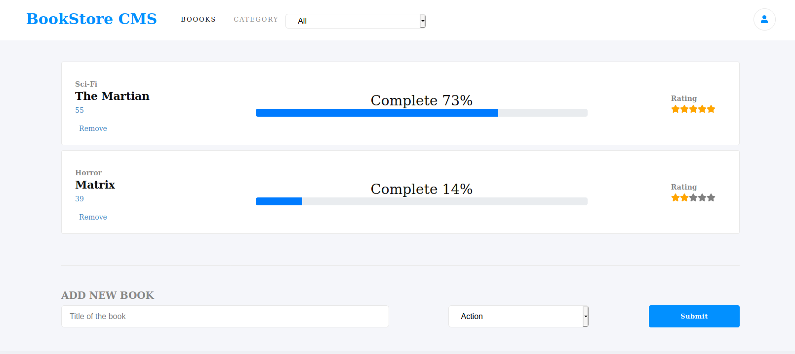

# Book Store 

    

> This project was bootstrapped with [Create React App](https://github.com/facebook/create-react-app).

## Live Preview
You can visit the live version of the site on this [link](https://limitless-refuge-25854.herokuapp.com/)

## Built With

 - HTML.
 - CSS.
 - JavaScript.
 - React.
 - ReactDOM.
 - Redux.
 - [PropTypes](https://www.npmjs.com/package/prop-types).
 - [Eslint](https://eslint.org/docs/user-guide/getting-started).
 - StyleLint.
 - Github Actions.
 - Heroku.

## Get a local copy

To get a local copy up and running follow these simple example steps.

Download the project

$ git clone https://github.com/JuanPabloGil/BookStoreReact.git

or

Download the project from this link

https://github.com/JuanPabloGil/BookStoreReact/archive/master.zip

## Available Scripts

In the project directory, you can run:

    `npm start`

Runs the app in the development mode. 
Open [http://localhost:3000](http://localhost:3000) to view it in the browser.

The page will reload if you make edits. 
You will also see any lint errors in the console.

    `npm test`

Launches the test runner in the interactive watch mode. 
See the section about [running tests](https://facebook.github.io/create-react-app/docs/running-tests) for more information.

    `npm build`

Builds the app for production to the `build` folder. 
It correctly bundles React in production mode and optimizes the build for the best performance.

## Author

👤 **Juan Pablo Gil**

- [GitHub](https://github.com/JuanPabloGil )
- [@LinkedIn](https://www.linkedin.com/in/juan-pablo-gil-1321a515a/)
- jpablomgil@gmail.com

👤 **Salvador Olvera**

- Linkedin: [Salvador Olvera](https://www.linkedin.com/in/salvador-olvera-n)
- Github: [@Salvador-ON](https://github.com/Salvador-ON)
- Twitter: [@Salvador Olvera_ON](https://twitter.com/Salvador_ON) 

## 🤝 Contributing

Contributions, issues and feature requests are welcome!

Feel free to check the [issues page](https://github.com/JuanPabloGil/BookStoreReact/issues).

## Show your support

Give a ⭐️ if you like this project!

## 📝 License

This project is [MIT]() licensed.